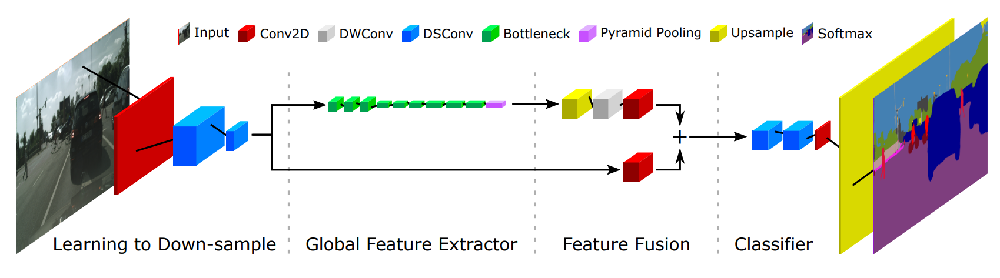
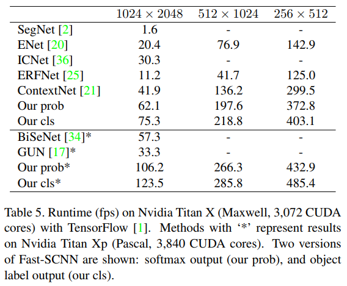
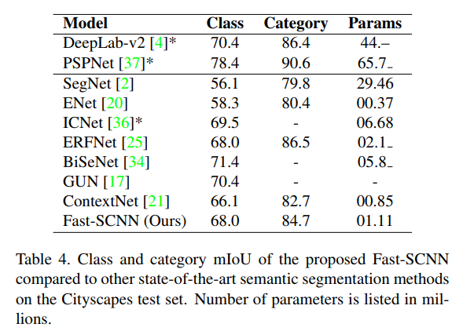

# Fast-SCNN: Fast Semantic Segmentation Network 
Unofficial implementation of the model architecture of [Fast-SCNN](https://arxiv.org/abs/1902.04502). Real-time Semantic Segmentation and mobile friendly memory consumption.

##### Tested with Python 3.6 and Pytorch '1.0.1.post2'




------------------


## Example

```python
from fast_scnn import Fast_SCNN
model = Fast_SCNN(input_channel=3, num_classes=10)
```


------------------


## Results with Fast-SCNN

### Inference Speed (fps) on Cityscapes



### mIoU on Cityscapes

